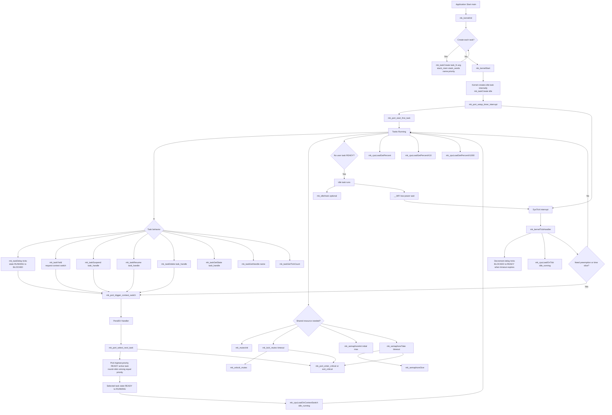

# MK RTOS Kernel API Flowchart

This flowchart is designed for beginners to understand when each API is used and how control moves between application code, scheduler logic, and interrupts.

## Quick Reading Guide

- Startup order: mk_kernelInit -> mk_taskCreate repeated -> mk_kernelStart.
- Task stack ownership: each task stack is provided by the application using stack_mem and stack_words.
- Scheduling rule: highest priority READY active task runs; same priority tasks are round-robin.
- Deletion model: mk_taskDelete marks slot inactive, so scheduler skips it in future selections.
- Sync model: mutex and semaphore APIs are cooperative with timeout-based waiting.
- CPU load APIs: read from application; update functions are called by kernel internals.
